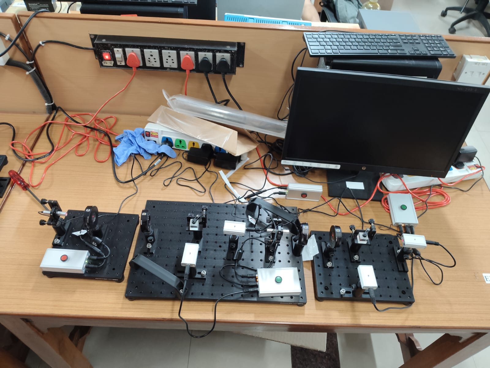

# QKD and Quantum Sensing 
### Research Internship | IIT Bombay (May 2025 – July 2025)

This repository contains simulations, experimental data analysis, and documentation for two distinct research projects conducted  at IIT Bombay. The projects focus on Quantum Key Distribution (QKD) implementations and Bayesian Signal Enhancement for quantum sensing.

---

## Table of Contents
1. [Project I: Experimental Quantum Cryptography (BB84 Protocol)](#project-i-experimental-quantum-cryptography-bb84-protocol)
2. [Project II: Bayesian Photon Number Resolving for EMCCD Cameras](#project-ii-bayesian-photon-number-resolving-for-emccd-cameras)
3. [Skills & Tools](#skills--tools)

---

## Project I: Experimental Quantum Cryptography (BB84 Protocol)

### Overview

This project focused on the experimental setup, simulation, and analysis of quantum key distribution (QKD) using a Thorlabs Quantum Cryptography Demonstration Kit. The primary objective was to demonstrate secure communication using light polarization and to experimentally validate the security of the BB84 protocol against eavesdropping attacks.

* **Role:** set up the experiment & simulate BB84. (Collaborated with a partner who implemented B92 and E91 protocols).

### Key Implementations

#### 1. BB84 Protocol (Experimental & Simulation)

**Experimental Setup:** Constructed a free space optical line using Polarizing Beam Splitters (PBS) and Half-Wave Plates (HWP) to encode classical bits into photon polarization states.

* **Protocol Execution:**
* Implemented the standard four-state protocol using Rectilinear () and Diagonal () polarization bases.
* Executed the Sifting Process (basis reconciliation) over a public channel, where Alice and Bob discard bits measured in mismatched bases.
* Developed `BB84_Simulation.py` (using Qiskit) to model the protocol numerically and verify theoretical error rates.

* **Security Analysis (Eavesdropping):**
* Simulated an Intercept-Resend Attack where an eavesdropper ("Eve") measures and resends photons.
* Demonstrated that this attack introduces a Quantum Bit Error Rate (QBER) of , satisfying the theoretical threshold to abort the protocol.

#### 2. Theoretical Analysis (B92 & E91)

* **B92 Protocol:** Conducted a trade-off analysis comparing BB84 to B92. Concluded that while B92 requires fewer states (two non-orthogonal), it suffers from higher discard rates and lower key generation efficiency due to angular dependencies.
* **E91 (Ekert) Protocol:** Analyzed entanglement-based security, studying how Bell’s Inequality violations (CHSH test) can certify the absence of an eavesdropper, shifting the trust model from the source to the channel statistics.

---

### Experimental & Simulation Data

#### **Scenario A: Secure Transmission (No Eavesdropper)**

* **Transmission:** 50 photons sent.
* **Sifted Key Length:** 32 bits 
* **Result:** Success. The generated key perfectly decrypted the target message:
> "BLUE"  `01000010 01001100 01010101 01000101`

#### **Scenario B: Intercept-Resend Attack (With Eavesdropper)**

* **Observed Error Rate (QBER):** **22.72%** * *Note: This is statistically consistent with the theoretical limit of 25% for small sample sizes.*
* **Result:** Failure. The high error rate was successfully flagged by the system.
* Attempted decryption resulted in corrupted text (Output: I?RH ), confirming the intrusion was detected and the key was discarded.

---

### Code Structure

The repository includes the following Python scripts used for verification:

* `bb84_sim.py`: Simulates the ideal transmission and basis reconciliation.
* `eavesdropper_sim.py`: Models the "Eve" scenario and calculates QBER.
---

## Project II: Bayesian Photon Number Resolving for EMCCD Cameras

## Overview

This module contains a MATLAB implementation of a Bayesian photon-number-resolving algorithm for Electron Multiplying Charge Coupled Device (EMCCD) cameras.

The project reproduces the methodology described in **Chatterjee et al. (2024)**, demonstrating how statistical inference can recover multi-photon events from noisy analog signals. By resolving discrete photon numbers () rather than using a standard binary threshold, this method significantly enhances the Signal to Noise Ratio (SNR) for applications involving Nitrogen-Vacancy (NV) centers and other low-light quantum systems.

## Key Features

* **Virtual EMCCD Simulator:** Generates synthetic raw data simulating Poissonian photon statistics, stochastic gain (Gamma distribution), Clock Induced Charge (CIC), and Gaussian readout noise.
* **Bayesian Thresholding:** Calculates pixel-wise probability thresholds to distinguish between  and  photons based on local beam intensity.
* **SNR Enhancement:** Demonstrates a significant improvement in contrast for spatially correlated photon beams compared to standard binary counting.
* **Robustness Analysis:** Characterizes algorithm performance across different EMCCD gain settings.
* **Quantum Sensing Application:** Simulates high-flux Optically Detected Magnetic Resonance (ODMR) experiments to showcase sensitivity gains in NV centers.

## Module Structure

The MATLAB scripts are organized into five logical modules. They should be run in the following order:

### 1. `data_generation.m`

Simulates the physical EMCCD camera and generates a stack of raw analog frames from a Gaussian beam profile.

* **Key Output:** `Raw_Stack` (3D matrix of simulated analog counts).

### 2. `calibrate_thresholds.m`

Performs Bayesian inversion to generate a "Threshold Map" for the entire image. It calculates the optimal count boundaries for detecting 0, 1, 2, or 3 photons at every pixel based on the local mean intensity.

* **Key Output:** `Thresh_Map` (Spatial map of T1, T2, T3, T4 thresholds).

### 3. `process_data.m`

Applies the calibrated threshold map to the raw data to "tag" discrete photons. It then performs a comparative analysis of the SNR obtained via the new Resolved Method versus the standard Binary Method.

* **Key Output:** Console printout of SNR metrics and Improvement Factor.

### 4. `parameter_sweep.m` (Standalone)

Performs a parameter sweep (SNR vs. EMCCD Gain) to determine the minimum experimental gain required for effective photon resolution.

* **Key Output:** Plot of Improvement Factor vs. Gain.

### 5. `odmr_simulation.m` (Standalone)

Simulates an ODMR frequency sweep for an NV center in the high-flux (saturation) regime. This script demonstrates how resolving multi-photon events prevents signal saturation and recovers the true depth of the magnetic resonance dip.

* **Key Output:** ODMR spectrum plot and Sensitivity Gain metric.

## Physics & References

This work relies on the statistical model where the output count  for  input electrons follows a Gamma distribution convolved with Gaussian readout noise:

**Reference:**
Chatterjee, R., Bhat, V. S., Bajar, K., & Mujumdar, S. (2024). *Multifold enhancement of quantum SNR by using an EMCCD as a photon number resolving device*. arXiv:2312.04184.

## Skills & Tools
* **Programming:** MATLAB (Numerical Simulations), Python (Data Analysis).
* **Hardware:** Thorlabs Quantum Cryptography Kit, Polarizing Beam Splitters, Half-Wave Plates.
* **Concepts:** Quantum Key Distribution (BB84/B92/E91), Bayesian Inference, NV Centers, Signal to Noise Ratio (SNR) Optimization.

---

*Email: saptarshi.das090@gmail.com
